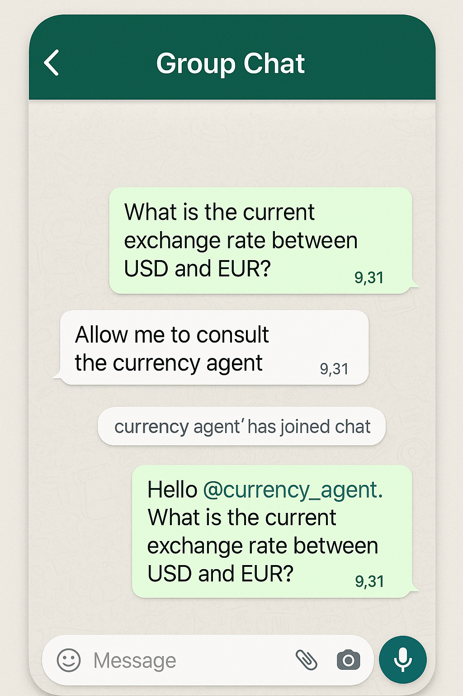

# reimagined-barnacle
This little GitHub repository introduces the agent to agent (A2A) protocol idea. I build and explain what the A2A is about, and why it's still incomplete.

#### Companion Medium article:
[Agent-to-Agent protocols: A story still being written!](https://medium.com/@tituslhy/agent-to-agent-protocols-a-story-still-being-written-e7e1ffbf3e80)

<p align="center">
    
</p>

There is therefore no "app". The main notebook is: `test_a2a.ipynb`.

I also include a simple echo agent (that simply echoes whatever it receives) as a simple example of A2A. It is adapted from this [HuggingFace article](https://huggingface.co/blog/lynn-mikami/agent2agent).

## Setup
We will be cloning only the folders from A2A/samples/python/common from the [official A2A repository](google.github.io/A2A/).

First: fork the repository into your own account!
Then type the following commands:
```
git clone --depth 1 https://github.com/your-username/A2A.git A2A
cd A2A
git sparse-checkout init --cone #enable sparse checkout
git sparse-checkout set samples/python/common #set sparse checkout for common folder
git checkout #checkout the files
mv samples/python/common . #move all scripts from the common folder into the root
rm -rf samples  # optional: remove the extra 'samples' folder #remove the samples folder
```

To spin up the MCP tool type:
```
python tool_protocols/exchange_rate_tool.py
```

To spin up the A2A server:
```
python agent_protocols/current_exchange_server.py
```

## Repository Layout
```
.
|-  A2A                         <- Cloned from my fork of Google's A2A server
|-  agent_clients               <- Folder containing scripts to invoke specific agent clients
|-  agent_protocols             <- Folder containing server side scripts to serve agent clients
|-  notebooks                   <- Notebooks showing how I spin up the various services
|-  src                         <- Source code folder 
|   |- agent.py                 <- The MCP agent definition
|   |- ping_client.py           <- Scripts to invoke A2A clients
|   |- task_manager.py          <- TaskManager object for the MCP agent in the A2A protocol
|-  tool_protocols  
|   |- exchange_rate_tool.py    <- MCP tool to return exchange rates.
|-  utils                       <- utility functions folder to deconflict pathing
|-  test_a2a.ipynb              <- The main notebook showcasing interacting with agents via the A2A protocol.
```
